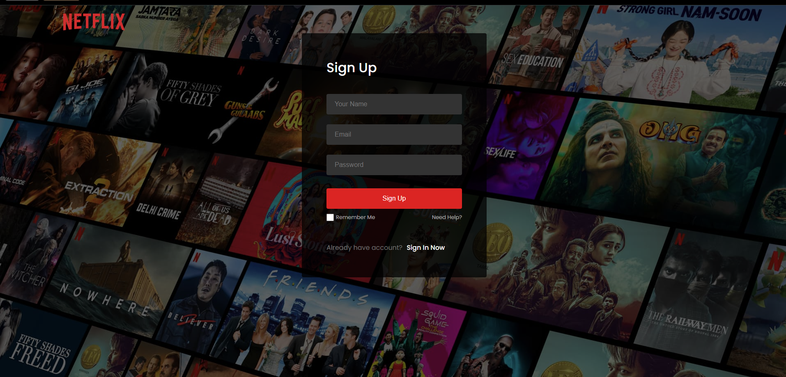
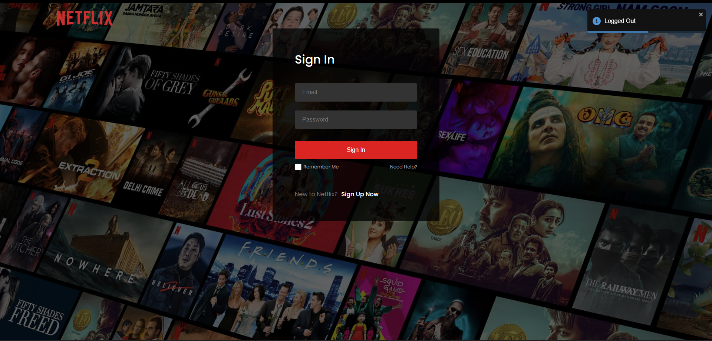
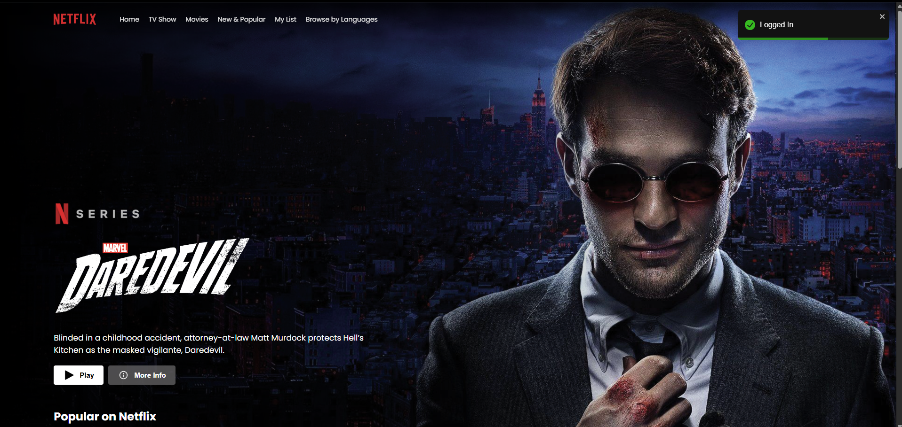
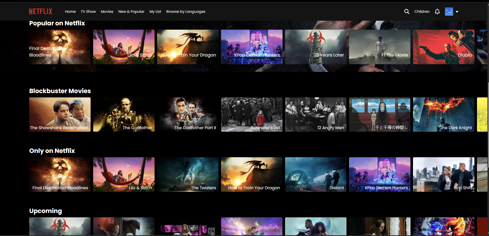
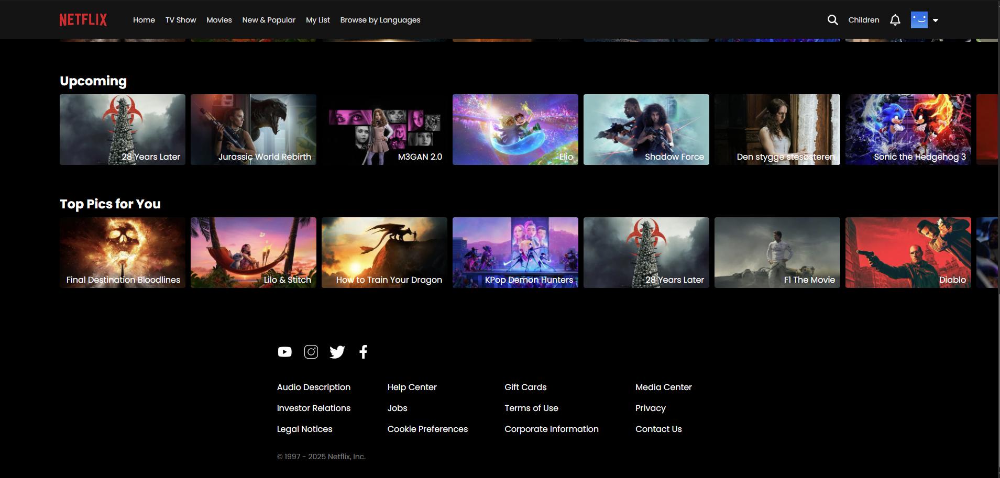

# Netflix-C 🎬

A clean and responsive **Netflix UI Clone** built using **React**, **Tailwind CSS**, and **TMDB API** for movie data. Hosted on **Vercel**.

> Live Demo: [netflix-c-gamma.vercel.app](https://netflix-c-gamma.vercel.app/)

---

## 🔥 Features

- 🚀 Built with React JS and Tailwind CSS
- 🎥 Fetches real movie data using TMDB API
- 🎞️ Movie categories like Trending, Top Rated, Originals, etc.
- 🔍 Search bar functionality
- 📱 Fully responsive design

---

## 📸 Screenshots

### Sign Up


### Sign In


### Home Page


### Movies Effect


### Home Page


---

📬 Contact
Feel free to reach out:

📧 yparshant610@gmail.com

🐦 @yparshant610

📸 Instagram

---

## 🛠️ Tech Stack

- React + Vite
- Tailwind CSS
- TMDB API
- Vercel (Deployment)

---

## 🚧 Installation & Setup

```bash
# Clone the repo
git clone https://github.com/yparshant610/netflix-c.git
cd netflix-c

# Install dependencies
npm install

# Run development server
npm run dev

